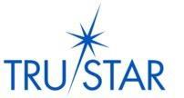

**TERMS OF USE (TOU) FOR TruSTAR PRODUCTS OFFERING**

TruSTAR TECHNOLOGY, INC., A DELAWARE CORPORATION (TruSTAR) IS WILLING TO GRANT YOU (AUTHORIZED USER) ACCESS TO THE TruSTAR PRODUCT OFFERING (THE SYSTEM) ONLY UPON THE CONDITION THAT YOU ACCEPT ALL THE TERMS CONTAINED HEREIN. BY CLICKING "ACCEPT" YOU CONSENT AND AGREE TO ALL THE TERMS OF THIS AGREEMENT. IF YOU DO NOT AGREE TO (OR CANNOT COMPLY WITH) ALL OF THE TERMS OF THIS AGREEMENT, THEN YOU MUST CLICK “DECLINE” AND YOU WILL NOT BE AUTHORIZED ACCESS TO USE THE TruSTAR SYSTEM. 

If You are using the Service on behalf of an entity, You represent and warrant that You are authorized to accept the Terms on such entity’s behalf, and that such entity agrees to indemnify You and TruSTAR Technology for violations of the Terms.

**Purpose.** You hereby agree that, notwithstanding any other provision of this Agreement or any related Agreement, the purpose of the Services to be undertaken by Provider under this Agreement is to receive Member Published Data, as it is uploaded, whether anonymized or not, to TruSTAR’s servers in order to develop analysis, write reports, and share tactical information with other TruSTAR Members, in order to supply TruSTAR Members with information about cyber threats, attack trends, and mitigation actions. 

**Definitions.** 
The following definitions shall apply to the Agreement:

* "**Agreement**" the terms and conditions of this TOU, as well as the terms and conditions contained in any related agreements.

*  "**Authorized User**" means any employee, officer, provider or agent of a TruSTAR Member or other sponsoring organization who is authorized hereunder to access the System and otherwise receive the Services.

*  "**Confidential Information**" means all data disclosed by one party (“Discloser”) to the other party (“Recipient”), whether before or after the execution of this Agreement, in any form whatsoever, that is Member Data, or is information specifically marked as “confidential” or with similar designation. For clarity, Member Published Data will not be considered Confidential Information.

*  "**Disaster**" means one or more of the following: (i) loss of the Services or the System used to provide the Services; (ii) destruction or loss of a component that prevents Provider from providing the Services; or (iii) an event or potential event, natural or otherwise, which threatens to prevent the provision of the Service from the primary data center. 

*  "**Documentation**" means user and technical manuals and other documentation provided to Member hereunder describing the Services, the System, and their respective features, functionality, requirements and specifications. 

*  **"Insolvency Event"** means that a party becomes insolvent, makes a general assignment for the benefit of creditors, files a voluntary petition of bankruptcy, suffers or permits the appointment of a receiver for its business or assets, or becomes subject to any proceeding under any bankruptcy or insolvency law, whether domestic or foreign, or has wound up or liquidated, voluntarily or otherwise. 

*  **"Laws"** means applicable laws, rules, regulations, directives, ordinances, orders, governmental requirements or statutes.

*  **"Member"** means any person, business, partnership, corporation, or any other type of organization or legal entity, whether incorporated or not, who has a currently existing, executed an MSA with TruSTAR Inc. 

*  "**Member Data**" means any data or information in your possession or the possession of the Member and/or its Authorized Users prior to being uploaded to TruSTAR’s servers.

*  "**Member Published Data**" means any data or information, whether anonymized or not, which is uploaded to the TruSTAR servers. Data is uploaded to the TruSTAR servers when you or a Member submits a report via the ‘Submit’ button. For clarity, Member Published Data will not be considered Confidential Information. 

*  "**Person**" means an individual, a corporation, partnership, limited liability company, association, trust, unincorporated organization, or other legal entity or organization.

*  "**Prior Works**" means Provider’s prior knowledge, including works of authorship, the System, ideas, concepts, methodologies, and processes developed or acquired in connection with Provider’s performance of professional services without Member’s assistance before the Effective Date. 

*  **"Security Breach"** means any actual or reasonably suspected misuse, compromise, or unauthorized access or disclosure of the System or any data uploaded to the System.

*  "**Service**" or “**Services**” means access to, and use of, the System, together with any optional, related services provided to Member pursuant to the Agreement or applicable Statement of Work.

*  "**Statement of Work**" means any SOW incorporated into this MSA that references the foregoing.

*  "**the System**" means the computer program or programs compromising TruSTAR’s product offering including all software and user tools, the means of accessing the product provided to Member by Provider, new releases, updates, upgrades, modifications, patches and maintenance thereto. 

1. **Description of Services.**
   1. Services. This Agreement shall apply only to the services offered by the System and those included in this Agreement. In the event You desire Provider to provide additional services, (i.e., services other than the Services), including, without limitation, custom software development, enhanced implementation or integration, or the like, a separate, written agreement will be required.
   2. Set up. You are solely responsible for all hardware, network and other equipment required for implementation and use of the Services. 
   3. Service Level. 
      1. Availability
         1. Uptime
             1. Provider shall use commercially reasonable efforts to make the Services available 99.9% of the time on a 24x7 (twenty-‐four hours per day, seven days per week) basis during the Term ("Uptime Commitment").

2. **Monitoring.** Provider reserves the right to reasonably restrict Member’s and/or its Authorized Users’ ability to access the System if Member’s and/or its Authorized Users’ activity is adversely impacting the performance of the Services for other subscribers. Provider agrees to notify Member in cases where it restricts such use and use good faith efforts to determine an appropriate alternative or work-around solution

3. **Ownership Rights.**
   1. You hereby acknowledge and agree that your rights to access and utilize the System and receive the Services are strictly limited to those expressly set forth herein, and, as between You and Provider, all other rights, title and interest in and to the System, the Services, all data uploaded to TruSTAR’s server (Member Published Data), and any related intellectual property rights, are, and shall remain, the sole property of Provider. 

   2. Ownership of Data. Member shall be the sole owner and controller of all Member Data and the Provider shall be the sole owner and controller of all Member Published Data. TruSTAR will not sell, assign, lease or otherwise transfer, dispose of or provide Member Data to third parties.

   3. You shall not attempt, directly or indirectly, or allow any third party to attempt, to copy, modify, duplicate, create derivative works from, republish, co-brand, reverse compile or engineer, disassemble, download, transmit, rent, distribute or otherwise utilize all or any portion of the Services and/or System in any form or media or by any means whatsoever, except that a Member or Authorized User may copy or download data from the System solely for Member’s internal business use as contemplated by this Agreement or for any other use authorized by this Agreement. 

   4. Prior Works. Provider reserves all right, title, and interest in and to any of the Prior Works that Provider shall use in the performance of Services for Member. Provider hereby grants Member a non-exclusive, worldwide, royalty-free, license (with right to sublicense) to use its Prior Works during the Term of this Agreement and applicable Statement of Work as necessary to receive the Services. Nothing contained herein shall prohibit Provider from using any of Provider’s general knowledge to perform similar services for others. 

   5. The provisions of this Section 3 shall survive any termination of this Agreement. 

4. **Payment.** Any payment due Provider shall be made by Member and/or Authorized Users following receipt of Provider’s correct itemized invoice(s). The fees for Services issued hereunder shall be guaranteed for a twelve-month period. 

5. **Confidential Information.** 
   1. Confidential Information is, shall be and shall remain the exclusive property of the Discloser. Recipient shall treat Confidential Information in accordance with how Recipient ensures confidentiality of its own proprietary and other confidential information (which shall not fall below a reasonable standard of care). Recipient shall not use, copy, publish, distribute or disclose it to others, nor allow or authorize anyone else to do so, without Discloser’s prior written approval, such approval to be withheld, delayed or conditioned by Discloser in its sole discretion. You shall not directly or indirectly make use of Confidential Information except as expressly authorized under this Agreement. Recipient shall (except as provided for herein) promptly return Confidential Information to Discloser upon Discloser’s reasonable request. For clarity, Member Published Data shall not be considered Confidential Information for purposes of any obligation, duty, requirement, or prohibition imposed by this Agreement. 

    2. In the event that Recipient is made or becomes aware of any instance of unauthorized use or disclosure of the Discloser’s Confidential Information, Recipient agrees to notify Discloser of the same and to take such steps as may be reasonably directed by Discloser to prevent the recurrence of such unauthorized use or disclosure, and to mitigate any damages arising from the unauthorized use or disclosure. Furthermore, Recipient will cooperate with Discloser in pursuing any of Discloser’s legal remedies against third parties that have impermissibly accessed or used the disclosing Party’s Confidential Information that was in the possession of Recipient or its subcontractors, if any. You specifically agree that any breach of this Section 5 may result in irreparable harm. If a court of competent jurisdiction finds that Recipient has breached any of such obligations, Recipient agrees that, without any additional findings of irreparable injury or other conditions to injunctive relief, it will not oppose the entry of an appropriate order compelling its performance and restraining it from any further breaches (or attempted or threatened breaches).

    3. Provider will not disclose details of relationship with Member or Member's Authorized Users except that Provider can list official corporate logo of Member and/or official corporate logo of the company of the Authorized Users on Provider corporate website under the section devoted to existing users. Any other formal release related to Member or Member’s Authorized Users will be coordinated and approved via email from Member or other company associated with Member’s Authorized Users.

6. **Security.** 
    1. Physical Security. Any system or device used to store, process, access, or transmit data from System shall be physically secure in a manner reasonably consistent with industry best practices. At a minimum, such system or device shall either be fixed in a facility with controlled access and appropriate physical security or, in the case of a laptop or mobile device, shall automatically lock or log out after a defined period of inactivity and shall be capable of being managed and erased remotely by an authorized technology administrator. No data from System may be stored or transferred on any "thumb drive" or similar portable device.

    2. Logical Access. Any system or device used to store, process, access, or transmit Member Data or Member Published Data shall be logically secure in a manner reasonably consistent with industry best practices. At a minimum, access to any such system or device shall be: (i) protected by a firewall with all ports blocked except those required to be open, and (ii) limited to unique named users with Strong Passwords (as defined below) who have a need to know or access Member Data or Member Published Data. A "Strong Password" is a password comprised of no less than eight (8) characters and shall include at least one each of the following: uppercase letters, lowercase letters, numeric characters, and special characters. 

    3. Disposal. If You dispose of any system or device which has stored Member Published Data, You shall first erase such system or device using a double erase method (low values and high values) or by other materially comparable or better process. 

    4. Survival. Your obligations under this Section 6 shall continue for a period of five (5) years from the date of this Agreement’s termination or expiration.

7. **Default and Termination.** 
    1. Either You or TruSTAR may elect to terminate for any reason upon thirty (30) days written notice. In the event of termination prior to the expiration of the initial twelve-month period,  payment, if any, will be refundable on a pro-rated basis for the period thirty (30) days from date of receipt of the termination notice through the expiration this Agreement.

    2. Rights and Obligations of Parties upon Termination or Expiration. Upon the termination or expiration of this Agreement, Provider shall, upon Member’s reasonable request, make all reasonable efforts to provide the Member with a copy of all Member Published Data then in the Provider’s possession or control. 

8. **Limited Representations and Warranties.** 
    1. Provider hereby represents and warrants to You that it:
      1. Will perform the Services in a good and skillful manner, within the specified dates, time frames and milestones more fully set forth in the Agreement and any applicable Statement of Work, consistent with industry best practices, and make commercially reasonable efforts to meet the service levels.
      2. Shall insure that all other TruSTAR members and/or their Authorized Users meet materially similar requirements as those defined in this Agreement.

    2. You hereby represent and warrant to Provider that:
      1. You are not subject to any governmental, agency, or industry sanctions or restrictions. 
      2. You shall not use the Services for or in connection with the sharing of competitively sensitive information—such as recent, current, and future prices, cost data, or output levels—or otherwise attempt price or other competitive coordination among itself and others, including any other TruSTAR members; and
      3. You shall at all times use the Services, in accordance with any and all applicable local, state, and federal regulations and laws and only for the purposes authorized herein. 

     3. DISCLAIMER OF REPRESENTATIONS OR WARRANTIES. THE EXPRESS WARRANTIES MADE IN THIS AGREEMENT ARE THE ONLY WARRANTIES MADE BY PROVIDER WITH RESPECT TO THE SERVICES AND SOFTWARE PROVIDED HEREUNDER, AND SUCH EXPRESS WARRANTIES ARE MADE EXPRESSLY IN LIEU OF ALL OTHER WARRANTIES AND REPRESENTATIONS, EXPRESS OR IMPLIED, INCLUDING, BUT NOT LIMITED TO, ANY IMPLIED WARRANTIES OF NON-INFRINGEMENT, FITNESS FOR A PARTICULAR PURPOSE, OR WARRANTY OF MERCHANTABILITY THAT THE SERVICES WILL BE ERROR-FREE OR UNINTERRUPTED, AND THAT SYSTEM DATA IS ACCURATE OR APPROPRIATE FOR ANY PARTICULAR CIRCUMSTANCE OR ACTION. 

9. **Use.** 
    1. Service Use. Provider hereby grants You a non-exclusive, royalty-free, worldwide right to: (i) to use the Services, including the System and any and all software made available by Provider to You in conjunction with the performance of the Services, from an unlimited number of locations pursuant to the terms and conditions of this Agreement; and (ii) use the System for Your business purposes, including but not limited to for malware and cyber security threat identification, evaluation and remediation. 

    2. License. As of the Effective Date, and subject to the terms and conditions of this Agreement, Provider hereby grants to You, and You hereby accept a worldwide, royalty free, fully paid up, nonexclusive, and perpetual license to: (i) use the System consistent with Your business purpose and with this Agreement; (ii) and use, translate, modify or create derivative works to the Documentation, in whole or in part for use in connection with the permitted use of the System. 

    3. As between You and Provider, other than the limited use and license rights provided herein, all rights, title, and interest in and to the System, the Services, and Member Published Data and any related intellectual property rights, are, and shall remain, the sole property of Provider.

    4. You shall not modify, adapt, decompile, disassemble or reverse engineer the System without the written permission from Provider. You shall not rent, lease, lend, sell, sublicense, distribute, operate a service bureau business, or otherwise make the Services provided hereunder available to any third party, except as expressly permitted by or contemplated by this Agreement. You shall not attempt, directly or indirectly, or allow any third party to attempt, to copy, modify, duplicate, create derivative works from, republish, co-brand, reverse compile or engineer, disassemble, download, transmit, rent distribute or otherwise utilize all or any portion of the Services or System in any form or media or by any means whatsoever. 

10. **Indemnification.** 
    1. You hereby agree to defend and hold harmless Provider, its officers, directors, employees, agents and attorneys, from and against all third party suits, claims, or other actions, and will indemnify Provider, from any damages and expenses, including reasonable attorneys’ fees, arising out of or related to any breach by Member (or one its Authorized Users) of its material obligations hereunder, including the representations or warranties set forth in Section 8 above. 

    2. Provider hereby agrees to defend and hold harmless Member, its officers, directors, employees, agents and attorneys, from and against all suits, claims, or other actions, and will indemnify Member, from any damages and expenses, including reasonable attorneys’ fees, arising out of claims that Member’s use of the Services or System, as authorized hereunder, infringe any third party intellectual property rights.

    3. The foregoing indemnification shall be subject to the following: (i) The indemnified party promptly notifies the other party in writing of the claim; provided that the failure to so notify the indemnifying party shall not relieve the indemnifying party of any liability it may have to the indemnified party hereunder except to the extent the indemnifying party has been materially prejudiced thereby; (ii) the indemnifying party has sole control of the defense and all related settlement negotiations with respect to the claim, provided, however, that the indemnified party has the right, but not the obligation, to participate at its expense in the defense of any such claim of action through counsel of its own choosing; and (iii) the indemnified party cooperates fully to the extent necessary, and executes all documents necessary, for the defense of such claim.

11. **AUTHORIZED USERS’ LIABILITY/LIMITATION OF LIABILITY**. You hereby acknowledge, represent and agree that You accept sole and complete responsibility for: (a) the selection and use of the Services to achieve Member's intended results; (b) use of the Services, or the results obtained from the Services, including, without limitation, the data from System and any reports or alerts provided by TruSTAR; (c) whether to use the System tools available to You to anonymize any data You provide to TruSTAR hereunder; (d) any decisions regarding reliance on/use of data, results or other information obtained from or provided by the Services; (e) the terms of any contracts between Member and Authorized Users and or third parties. **Except for an intentional breach of a Party’s confidentiality and nondisclosure obligations, and except for obligations arising under a Party’s indemnification obligations hereunder, neither party will be liable to the other for incidental, consequential or special damages even if advised, in a sufficiently timely fashion to mitigate any such damages, of the possibility of such damages**; and (f) if You are participating as part of a sponsored membership through another organization, such the Cloud Security Alliance, You will not hold that organization liable for any breach or technological malfunction that occurs by participating in this initiative.

12. **Notices.** Any notice or other communications required or permitted hereunder shall be sufficiently given if in writing and delivered personally or sent by a reputable third party delivery service, registered mail, or certified mail, postage prepaid and addressed as noted in the System.

13. **Assignment.** You shall not assign, convey, encumber, or otherwise dispose of the Agreement or any rights or obligations hereunder without the prior express written consent of the other Party and any attempt to do so will be void. The Agreement shall be binding upon and inure to the benefit of You and TruSTAR hereto and their respective successors and permitted assigns.

14. **Relationship of Parties.** Provider represents that its business and the performance of Services shall satisfy the test of independent contractor status under applicable laws. Provider agrees that the Provider Personnel shall be, and will remain at all times during the performance of Services, Provider’s employees, agents or sub-contractors. Provider as applicable, shall comply with the requirements of the Fair Labor Standards Act, as amended, in providing Services hereunder. 

15. **Miscellaneous.**
    1. Governing Law; Forum Selection. This Agreement shall be governed exclusively by the laws of the District of Columbia, USA, without regard to its conflicts of laws principles. Any action under or concerning this Agreement shall be brought exclusively in the District of Columbia, USA. You irrevocably agree and consent that said forum is convenient and has jurisdiction to hear and decide any such action.

    2. Headings. The captions and headings herein are for convenience only, and shall not be deemed to constitute integral provisions of this Agreement.

    3. Severability. If any term, provision, covenant or condition of this Agreement is held invalid or unenforceable for any reason, the remainder of the provisions shall continue in full force and effect as if this Agreement had been executed with the invalid portion thereof eliminated, and a court of competent jurisdiction shall substitute for the invalid provision a valid and enforceable alternative which most closely approximates the original intent of the parties with respect to the affected provision.

    4. No Waiver. Your or TruSTAR’s delay or failure to exercise any right under this Agreement or to take action against the other party in the event of any breach of this Agreement shall not constitute a waiver of such right, or any other right, or of such breach, or any future breaches, under this Agreement.

    5. Force Majeure. Provider will not be held responsible for any delay or failure in performance of any part of this Agreement to the extent that such delay is caused by events or circumstances beyond the Provider's reasonable control, including but not limited to fire, flood, storm, act of God, war, malicious damage, failure of a utility service or transport or telecommunications network.

16. **EACH AND ALL OF THE PROVISIONS OF THIS TOU ARE HEREBY INCORPORATED INTO TruSTAR’S STANDARD MASTER SERVICES AGREEMENT ("MSA"), SO THAT EACH AND ALL OF THE FOREGOING TOU PROVISIONS SHALL CONSTITUTE A PART OF THE MSA. BY CLICKING “ACCEPT” YOU (“AUTHORIZED USER”) HEREBY CONSENT TO ALL THE TERMS AND CONDITIONS OF THE TruSTAR MSA. IN THE EVENT OF ANY CONFLICT OR INCONSISTENCY BETWEEN THE PROVISIONS OF THIS TOU, ON THE ONE HAND, AND THE PROVISIONS OF THE MSA, ON THE OTHER HAND, THE PROVISIONS OF THE MSA SHALL BE CONTROLLING.** 

17. **Counterparts.**
    1. This Agreement may be executed simultaneously with any number of counterparts, each of which shall be deemed an original, but all of which together shall constitute one and the same instrument.

